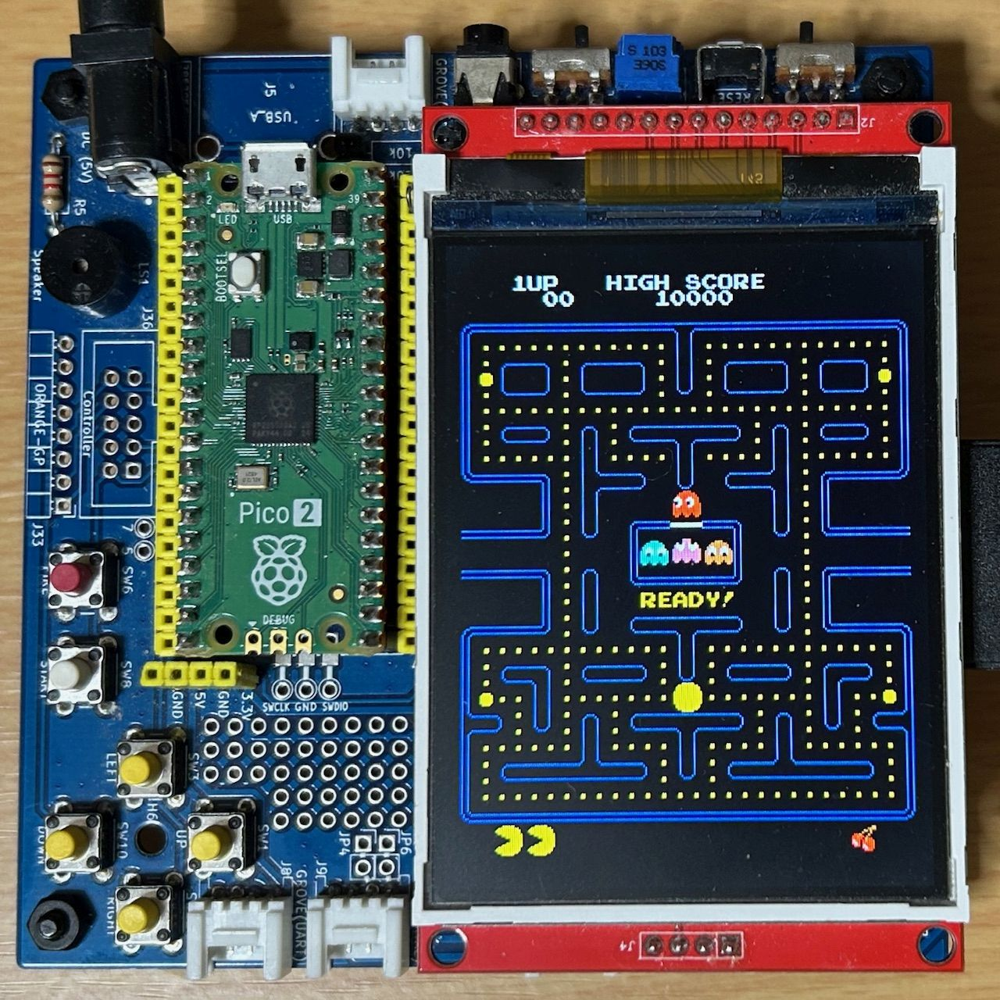

# PACMAN for MachiKania type P

BASICマイコンシステムMachiKania type Pの本体を使って遊べるパックマンです。アーケード版と同じタイプです。利用可能な液晶はILI9341を搭載した解像度240x320ドットのものとなります。

## 実行方法
BASICプログラムではありませんので、マイコンに実行ファイルを書き込む必要があります。Raspberry Pi PicoまたはRaspberry Pi Pico 2のBOOTボタンを押しながらUSBケーブルでPCに接続し、uf2ディレクトリのバイナリファイルをコピーしてください。  
* phyllosoma-pacman-pico.uf2 (Pico用)  
* phyllosoma-pacman-pico2.uf2 (Pico 2用)  

## 遊び方
MachiKania type PのボタンおよびUSBキーボードのどちらでも遊べます。USBキーボードの場合Enterキーでスタート、カーソルキーで移動します。  

## 設定
SDカードのMACHIKAP.INIファイルで、MachiKania type P同様に設定を行うことが可能です。利用可能な項目は以下の通りです。  
* LCD90TURN / LCD180TURN　液晶の上下を反対にする（どちらも同じ）
* ROTATEBUTTONS / NOROTATEBUTTONS　ボタンの向きを基板に合わせて回転する、またはしない
* LCDINVERT　IPS液晶を使用する  

## 参考リンク
[MachiKania type P](http://www.ze.em-net.ne.jp/~kenken/machikania/typep.html)  
